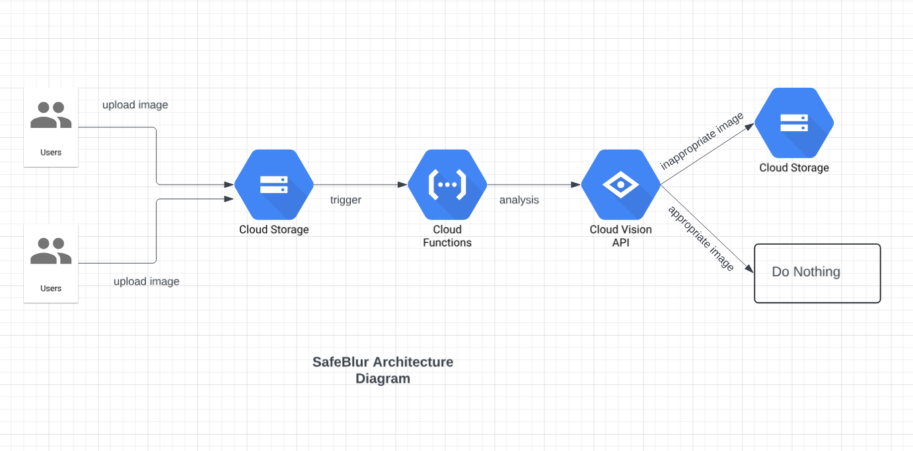
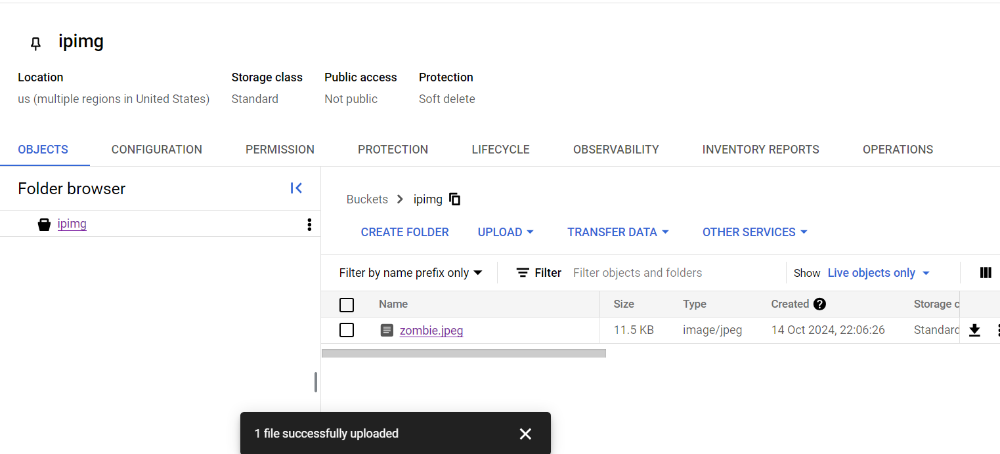
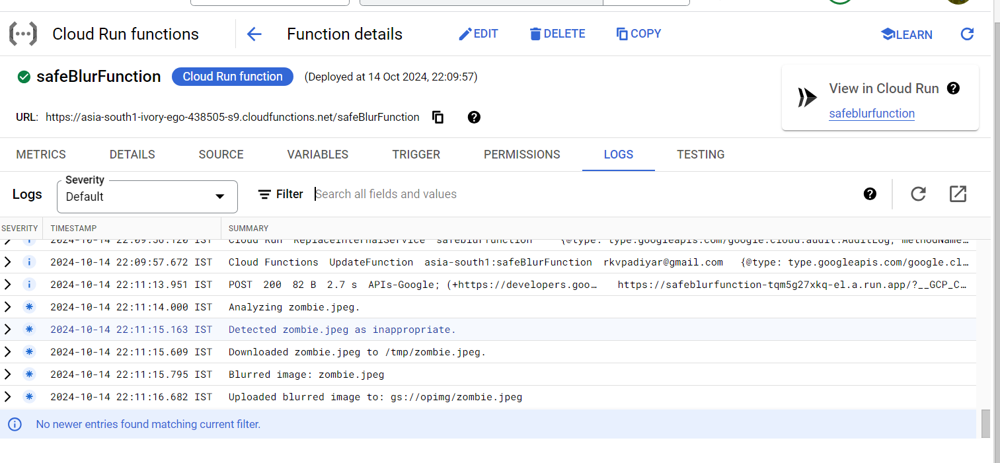
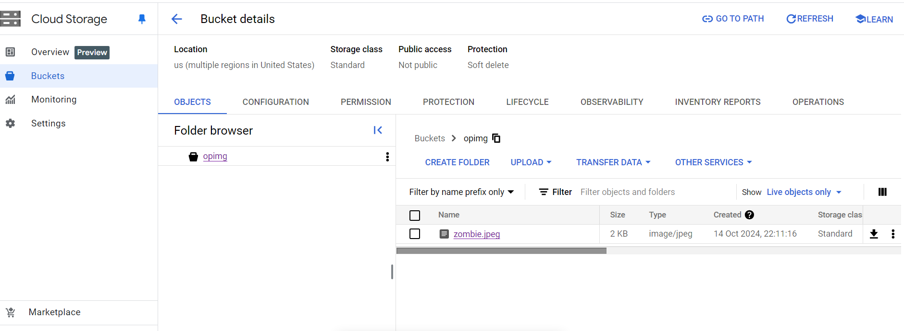
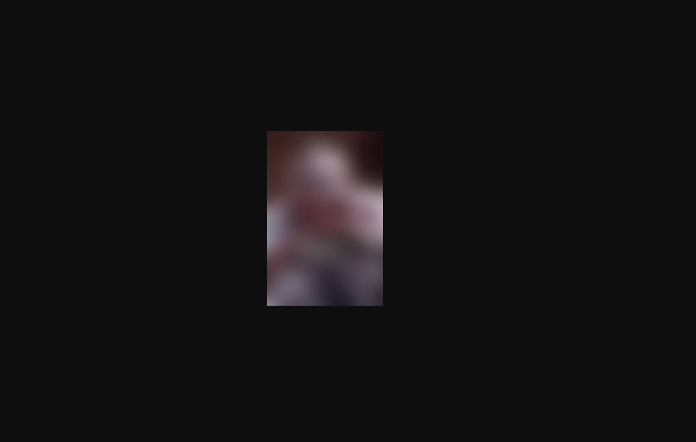

# SafeBlur: Automated Image Moderation Solution using GCP Native Services

## Overview

SafeBlur is an automated image moderation solution designed to ensure a safe online environment by detecting and blurring inappropriate user-uploaded images. Utilizing Google Cloud Functions, Cloud Storage, the Google Vision API, and GraphicsMagick, SafeBlur efficiently processes images uploaded to Google Cloud Storage.

## Features

- **Automated Moderation**: Automatically detects offensive content such as adult material and violence.
- **Image Processing**: Blurs images that contain inappropriate content to protect users.
- **Cloud-Based**: Fully leverages Google Cloud services for scalability and reliability.

## Architecture



### Components

1. **Google Cloud Functions**: Serves as the core processing unit triggered by image uploads.
2. **Google Vision API**: Analyzes images for potentially inappropriate content.
3. **GraphicsMagick**: Processes images by applying effects like blurring.
4. **Google Cloud Storage**: Stores original and processed images in separate buckets.

## Getting Started

### Prerequisites

- A Google Cloud account
- Google Cloud SDK installed
- Cloud Build API
- Cloud Functions API enabled
- Cloud Logging API enabled
- Cloud vision API enabled

### Installation

1. Clone the repository:

   ```bash
   git clone https://github.com/yourusername/safeBlur.git
   cd safeBur

   ```

2. Create two buckets: one for original images (INPUT_BUCKET_NAME) and another for blurred images (BLURRED_BUCKET_NAME)

3. Create Cloud Run Function with 2 environment variables ready.
   INPUT_BUCKET_NAME : <your-input-bucket-name>
   BLURRED_BUCKET_NAME : <your-blurred-bucket-name>
   Edit the default entrypoint of the function to : blurOffensiveImages
   Write the function in blurOffensiveImages.js, save and deploy.

### Test

How It Works :

1. Image Upload: When a user uploads an image to the Input Bucket, the Cloud Function is triggered.
2. Content Analysis: The function uses the Google Vision API to analyze the image for offensive content.
3. Image Processing: If the image is deemed inappropriate, it is downloaded and processed using GraphicsMagick to apply a blur effect.
4. Upload Blurred Image: The blurred image is uploaded to the Blurred Bucket.

Example : Upload a violent image (a Zombie eating human brain),

The Vision API classifies the image as inappropriate

The blurred image is created and uploaded into the Output Image Bucket(opimg)

The blurred Image created and uploaded :


Error Handling
The code includes error handling for:

> Image analysis failures  
> File download/upload issues  
> Image processing errors

### Benefits

Efficiency: Automates the tedious process of content moderation.  
Safety: Protects users by filtering out inappropriate content.  
Scalability: Built on Google Cloud, the system can handle large volumes of images.
